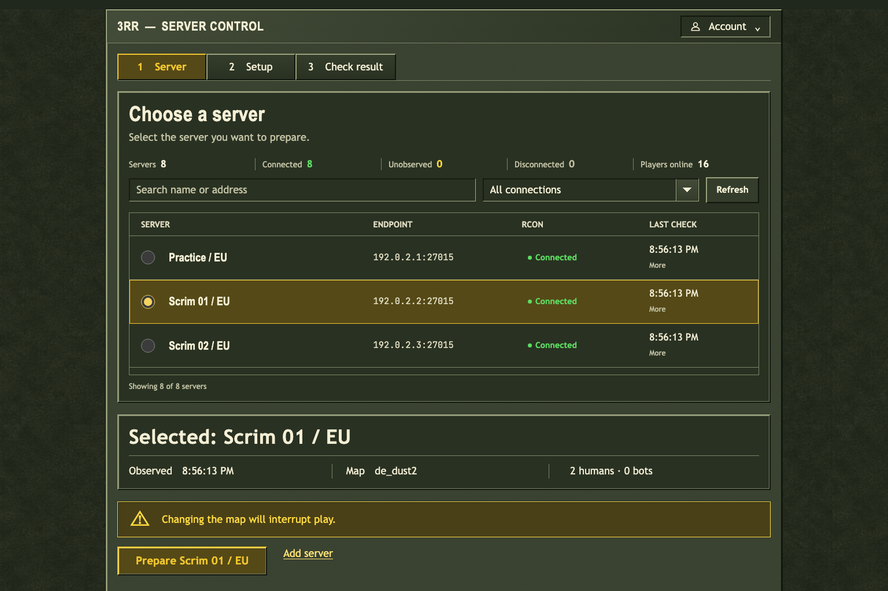
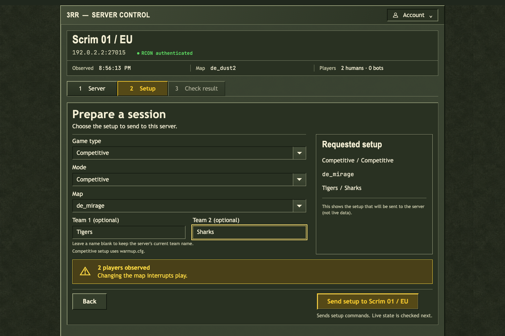
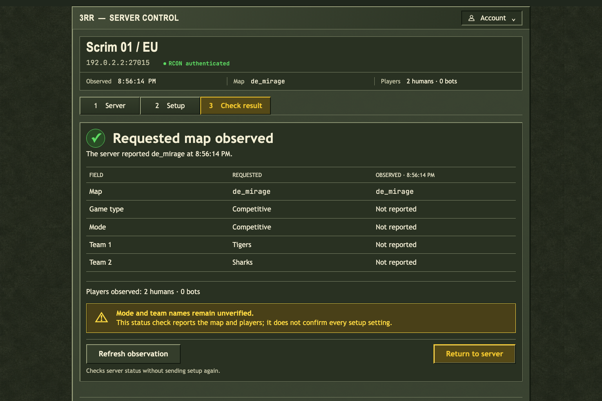
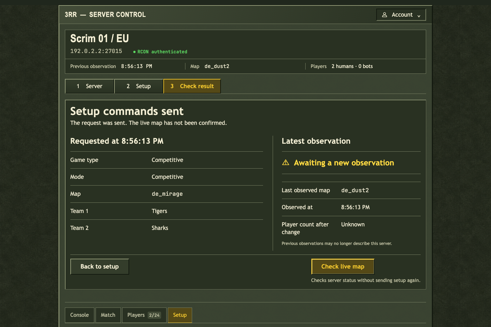
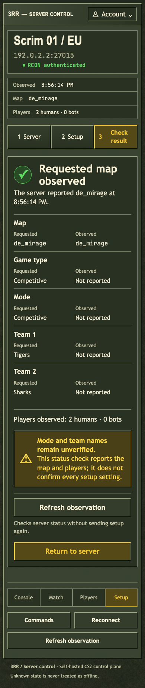

# 3RR

Browser control and host tooling for self-hosted CS2 servers.

[](https://github.com/sebastianspicker/3rr-cs2/actions/workflows/ci.yml)
[](https://github.com/sebastianspicker/3rr-cs2/actions/workflows/secret-scan.yml)

3RR helps you run self-hosted Counter-Strike 2 servers. Use the browser panel
to choose a server, prepare a practice session or scrim, manage players, and send RCON
commands. Separate tools handle Linux host updates and server configuration.

It is built for community operators and server administrators who already
have a CS2 host. You can use each component independently.

3RR is in alpha. Test it on a non-critical server before using it for a
scheduled match. See the [release checklist](docs/RELEASING.md) for deployment
and recovery checks.

[Try the browser demo](https://sebastianspicker.github.io/3rr-cs2/) ·
[Install the control plane](control-plane/README.md) ·
[Deployment examples](deploy/README.md)

## Screenshot tour

These are screenshots of the current control plane, using fictional servers
and simulated RCON responses. The [capture guide](docs/screenshots/README.md)
explains how to reproduce them.

### 1. Choose a server

See the servers you can access, their connection state, and the latest player
counts. Select the target before preparing a session.



### 2. Review the setup

Choose a game type, mode, and map, then add optional team names. The review
shows what will be sent; changing the map interrupts anyone playing.



### 3. Send commands, then check the map

A successful request means the setup commands were sent. A separate status
check compares the requested map with what the server reports. It does not
confirm settings the server has not reported, such as team names.



<details>
<summary>See the commands-sent step and mobile view</summary>





</details>

## Browser demo

The [GitHub Pages demo](https://sebastianspicker.github.io/3rr-cs2/) follows the
current panel's **Server → Setup → Check result** flow. Choose a sample server,
review its setup, send simulated commands, then check the reported map.

The demo uses the application's olive styling with fictional data. Every
action runs locally in your browser; it does not connect to a game server.
See [demo instructions](design-preview/README.md) for the available controls,
local use, and Pages setup on a fork.

## Components

| Component                                      | What it does                                                 | Requirements                                           |
| ---------------------------------------------- | ------------------------------------------------------------ | ------------------------------------------------------ |
| [Control plane](control-plane/README.md)       | Browser and HTTP access to existing servers over RCON        | Node 26, SQLite; Redis in production                   |
| [Host updater](host-updater/README.md)         | Stops, updates, and restarts an existing CS2 installation    | Linux, Bash, systemd, SteamCMD                         |
| [Server bootstrap](server-bootstrap/README.md) | CFG files, administrator-file generator, and startup wrapper | A CS2 runtime; see the component's plugin requirements |
| [Deployment examples](deploy/README.md)        | Compose and systemd configurations to adapt for your host    | Your own image, storage, network, and secrets          |

The control plane does not install or update CS2. The updater runs on the
Linux host independently of the panel. [Architecture](docs/architecture.md)
explains how each component works and which data it uses.

## Run the control plane locally

Install Node 26 and npm, then run from the repository root:

```bash
cd control-plane
npm ci
cp -n .env.example .env
chmod 600 .env
```

Edit `.env` before starting:

- Set `SESSION_SECRET` and `RCON_SECRET_KEY` to separate random values.
  Run `openssl rand -hex 32` once for each value.
- Set `DB_PATH=./data/3rr.db` for a database inside this checkout.
- For the first start on an empty database, set `ALLOW_DEFAULT_CREDENTIALS=true`,
  choose `DEFAULT_USERNAME`, and set `DEFAULT_PASSWORD` to at least 12 characters.

```bash
npm run build
node --env-file=.env dist/src/main.js
```

Open `http://localhost:3000` and sign in. Once the administrator exists, stop
the app, clear `DEFAULT_USERNAME` and `DEFAULT_PASSWORD`, set
`ALLOW_DEFAULT_CREDENTIALS=false`, and restart it. Add an existing CS2 server
using its address, port, and RCON password.

For deployment, follow the [control-plane guide](control-plane/README.md) and
[Compose examples](deploy/README.md). Production requires Redis and HTTPS.
The Compose example binds the panel to `127.0.0.1:3000`. Put a TLS reverse
proxy in front of it. Review the [CS2-side requirements](control-plane/docs/SERVER-SETUP.md)
before using CFG or plugin commands.

## Development

```bash
(cd control-plane && npm ci && npm run check)
(cd control-plane && npm run validate -- --require-docker)
(cd host-updater && make ci)
```

Run these commands from the repository root. The full repository check is:

```bash
./scripts/verify.sh
```

It requires Node 26 or its Docker fallback, a working Docker daemon and
Compose, `make`, `shellcheck`, `shfmt`, `jq`, `ruby`, and `curl`. It checks docs,
configuration, the control plane and container, updater behavior, and bootstrap
scripts, including that tracked executable file modes match
`scripts/executable-files.txt`. Live CS2/RCON, SteamCMD, systemd, production
Redis, and off-host recovery still need deployment testing. The static demo
has its own [checks](design-preview/README.md#checks).

Use `./scripts/verify.sh --only <section>[,<section>...]` to run a subset of
sections (`shared`, `control-plane`, `docker`, `host-updater`, `bootstrap`),
or `--quick` to run every section except `docker`. See `--help` for details.
Neither is a substitute for the full, no-argument run before a release.

See [CONTRIBUTING.md](CONTRIBUTING.md) for the contribution workflow and screenshot updates.

## Documentation

- [Configuration reference](docs/reference/env.md)
- [HTTP API](control-plane/docs/API.md) and [frontend maintenance](control-plane/docs/FRONTEND.md)
- [Control-plane runbook](control-plane/docs/RUNBOOK.md) and [backup and recovery](docs/recovery.md)
- [Provision a server](docs/workflows/provision-server.md),
  [operate it](docs/workflows/operate-server.md), and
  [update it](docs/workflows/update-server.md)
- [Migrate from Pterodactyl](docs/workflows/migrate-from-pterodactyl.md)
- [Product principles](PRODUCT.md) and [module provenance](docs/reference/provenance.md)

## Security and license

Keep session secrets, RCON keys and passwords, Game Server Login Tokens,
administrator files, and databases out of Git. Restrict RCON access to trusted
hosts. Report vulnerabilities through [SECURITY.md](SECURITY.md).

[MIT License](LICENSE). Imported modules and bundled fonts retain their
respective license notices.

## Repository naming

This repository was renamed from `3rr` to `3rr-cs2`; GitHub redirects the old
links. The product, package, and data names are still `3rr`.
