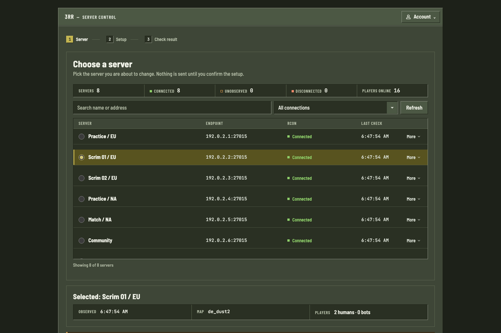
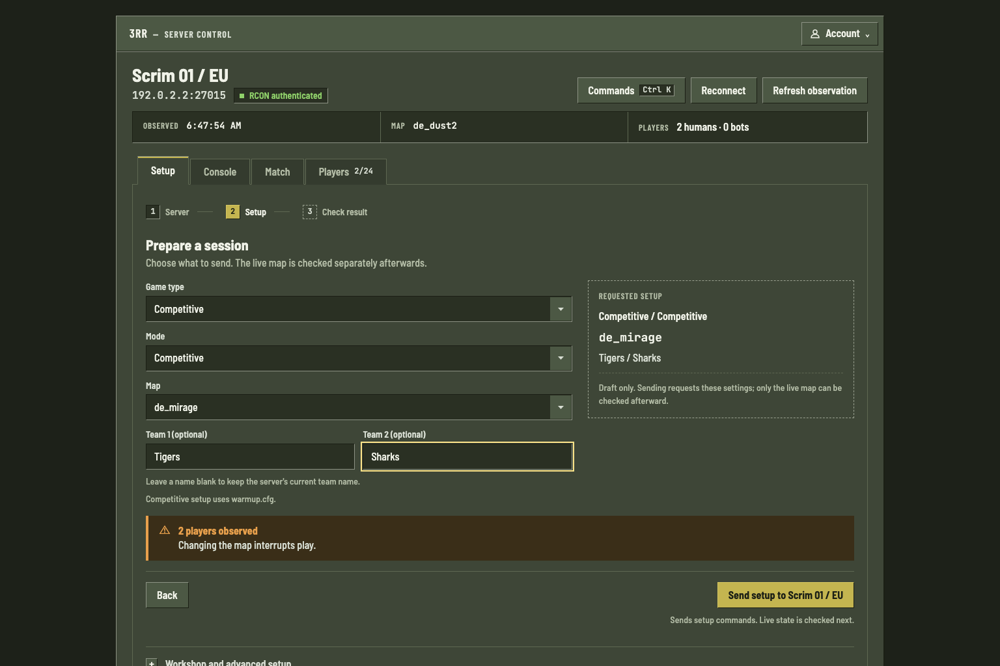
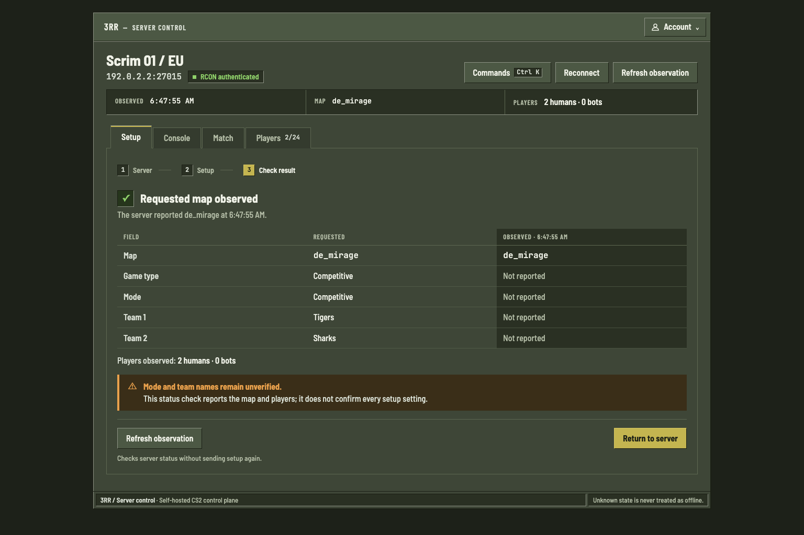
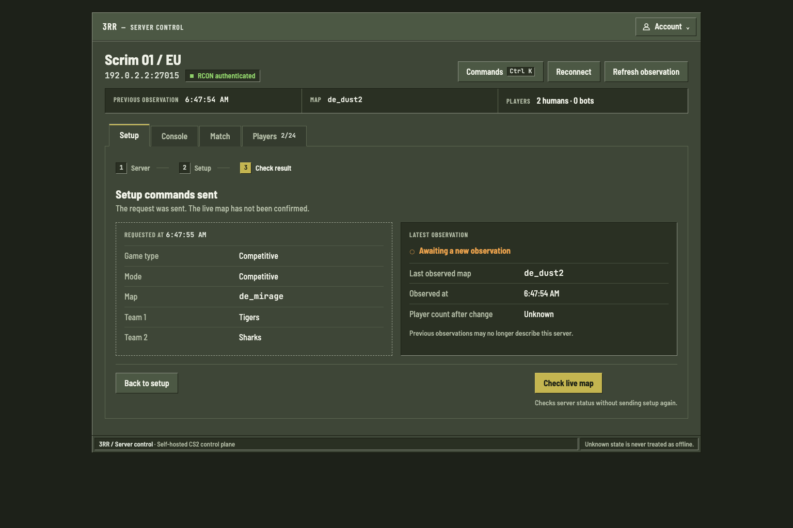
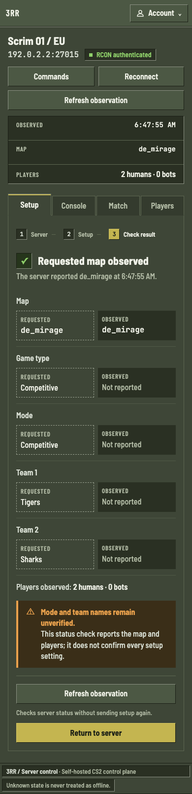

# 3RR

Browser control and host tooling for self-hosted Counter-Strike 2 (CS2) servers.

[](https://github.com/sebastianspicker/3rr-cs2/actions/workflows/ci.yml)
[](https://github.com/sebastianspicker/3rr-cs2/actions/workflows/secret-scan.yml)

## In short

- **What it does.** From a browser you choose one of your CS2 servers, prepare a practice
  session or scrim, manage players, and send RCON commands (RCON is the password-protected
  remote console). Separate command-line tools handle Linux host updates and server
  configuration.
- **Who it's for.** Community operators and server administrators who **already have a CS2
  host**. Each part of 3RR works on its own, so you can use only what you need.

- **Status: alpha.** Try it on a non-critical server before you use it for a scheduled
  match. Review the [deployment examples](deploy/README.md) and
  [recovery guide](docs/recovery.md) before a real deployment.
- **The core idea.** 3RR never treats "command sent" as "done". It shows what you
  *requested* separately from what the server actually *reports*.

[Try the browser demo](https://sebastianspicker.github.io/3rr-cs2/) ·
[Install the panel](control-plane/README.md) ·
[Deployment examples](deploy/README.md)

## Screenshot tour

These screenshots show the current panel with fictional servers and simulated RCON replies.
The [screenshot notes](docs/screenshots/README.md) describe the simulated data.

### 1. Choose a server

The list shows the servers you are allowed to access, whether the panel is connected to each
one, and its latest player count. Pick the target server before you prepare a session.



### 2. Review the setup

Choose a game type, mode and map, and optionally name the teams. A review screen shows
exactly what will be sent. **Changing the map interrupts anyone who is playing.**



### 3. Send, then check the map

A successful send means only that the setup commands *were sent*. A separate status check
then compares the map you requested with the map the server reports. It does not confirm
anything the server doesn't report back, such as team names.



<details>
<summary>See the commands-sent step and mobile view</summary>





</details>

## Try the browser demo

The [GitHub Pages demo](https://sebastianspicker.github.io/3rr-cs2/) follows the panel's
**Server → Setup → Check result** flow. Pick a sample server, review its setup, send
simulated commands, then check the reported map.

The demo uses the panel's olive styling with fictional data. **Everything runs in your
browser; it never connects to a game server.** The
[demo instructions](design-preview/README.md) cover the controls, local use, and setting
up Pages on a fork.

## What's included, and what isn't

| Component                                         | What it does                                                          | What you need                                          |
| ------------------------------------------------- | --------------------------------------------------------------------- | ------------------------------------------------------ |
| [Panel (control plane)](control-plane/README.md) | Browser and HTTP access to your existing servers over RCON            | Node 26, SQLite; Redis in production                   |
| [Host updater](host-updater/README.md)         | Stops, updates, and restarts an existing CS2 installation             | Linux, Bash, systemd, SteamCMD                         |
| [Server bootstrap](server-bootstrap/README.md) | CFG files, a generator for administrator files, and a startup wrapper | A CS2 runtime; see the component's plugin requirements |
| [Deployment examples](deploy/README.md)        | Compose and systemd configurations to adapt for your host             | Your own image, storage, network, and secrets          |

The panel does **not** install or update CS2. The updater runs on the Linux host independently
of the panel. [Architecture](docs/architecture.md) explains how each part works and which data
it uses.

## Run the panel locally

Install Node 26 and npm, then run from the repository root:

```bash
cd control-plane
npm ci
cp -n .env.example .env
chmod 600 .env
```

The last command makes the settings file readable only by you. Edit `.env` before you start:

- Set `SESSION_SECRET` (signs login sessions) and `RCON_SECRET_KEY` (the RCON encryption key,
  which encrypts stored RCON passwords) to **two different** random values. Run
  `openssl rand -hex 32` once for each value.
- Set `DB_PATH=./data/3rr.db` to keep the database inside this checkout.
- For the first start on an empty database, set `ALLOW_DEFAULT_CREDENTIALS=true`, choose a
  `DEFAULT_USERNAME`, and set `DEFAULT_PASSWORD` to at least 12 characters.

Then build and start:

```bash
npm run build
node --env-file=.env dist/src/main.js
```

Open `http://localhost:3000` and sign in. Once the administrator exists, stop the app, clear
`DEFAULT_USERNAME` and `DEFAULT_PASSWORD`, set `ALLOW_DEFAULT_CREDENTIALS=false`, and restart
it. Then add an existing CS2 server with its address, port, and RCON password.

## Before a real deployment

- Follow the [panel guide](control-plane/README.md) and the
  [Compose examples](deploy/README.md).
- **Production requires Redis and HTTPS.**
- The Compose example makes the panel reachable only from the host itself (`127.0.0.1:3000`).
  Put a reverse proxy that handles HTTPS (TLS) in front of it.
- Before you use CFG-based or plugin-based commands, read the
  [CS2 server requirements](control-plane/docs/SERVER-SETUP.md): the panel can only trigger
  what is installed on the server.

## Check a local build

Run these from the repository root:

```bash
(cd control-plane && npm ci && npm run typecheck && npm run build)
(cd control-plane && npm run validate -- --require-docker)
node design-preview/build.mjs --check
bash scripts/check-deployment-contract.sh
```

The container validation requires Docker with Compose, plus `shellcheck`, `shfmt`,
`jq`, and `ruby`. These checks do not exercise live CS2 and RCON, SteamCMD,
systemd, production Redis, or off-host recovery. See
[CONTRIBUTING.md](CONTRIBUTING.md) for the contribution workflow.

## Documentation map

- [Configuration reference](docs/reference/env.md)
- [HTTP API](control-plane/docs/API.md) and
  [frontend maintenance](control-plane/docs/FRONTEND.md)
- [Panel runbook](control-plane/docs/RUNBOOK.md) and
  [backup and recovery](docs/recovery.md)
- [Provision a server](docs/workflows/provision-server.md),
  [operate it](docs/workflows/operate-server.md), and
  [update it](docs/workflows/update-server.md)
- [Migrate from Pterodactyl](docs/workflows/migrate-from-pterodactyl.md)
- [Product principles](PRODUCT.md) and
  [module provenance](docs/reference/provenance.md)

## Security and license

Never commit session secrets, RCON keys or passwords, Game Server Login Tokens,
administrator files, or databases to Git. Allow RCON only from trusted hosts. Report
vulnerabilities as described in [SECURITY.md](SECURITY.md).

[MIT License](LICENSE). Bundled fonts keep their own license notices.

## Repository name

This repository was renamed from `3rr` to `3rr-cs2`, and GitHub redirects the old links. The
product, package, and data names are still `3rr`.

## Glossary

- **CFG file**: a text file of CS2 console commands, run with `exec`.
- **Compose (Docker Compose)**: a tool that starts several containers from one configuration
  file.
- **Game Server Login Token (GSLT)**: a Steam token that identifies a public game server.
- **Panel (control plane)**: 3RR's web application.
- **RCON**: remote console, the password-protected protocol for sending console commands to a
  game server.
- **RCON encryption key (`RCON_SECRET_KEY`)**: the key the panel uses to encrypt stored RCON
  passwords.
- **Redis**: a data store the panel uses in production for login sessions and rate limits.
- **Reverse proxy / TLS / HTTPS**: a web server in front of the panel that provides the
  encrypted `https://` connection.
- **SQLite**: the single-file database that holds the panel's users, servers, and history.
- **SteamCMD**: Valve's command-line tool for installing and updating game servers.
- **systemd**: the Linux service manager that starts and stops services.
