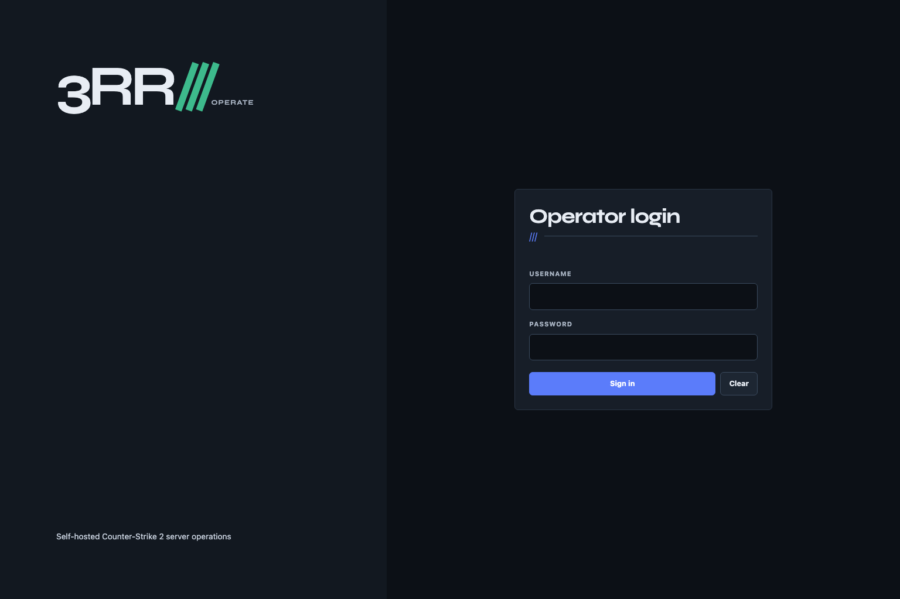
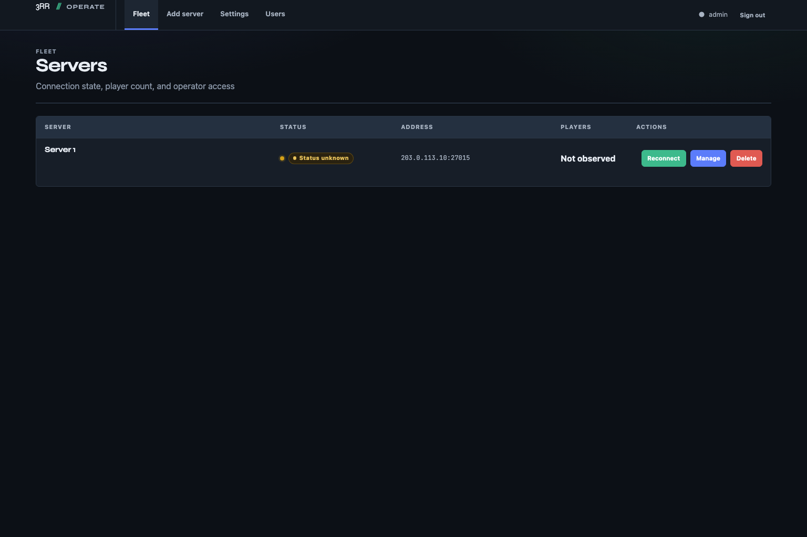
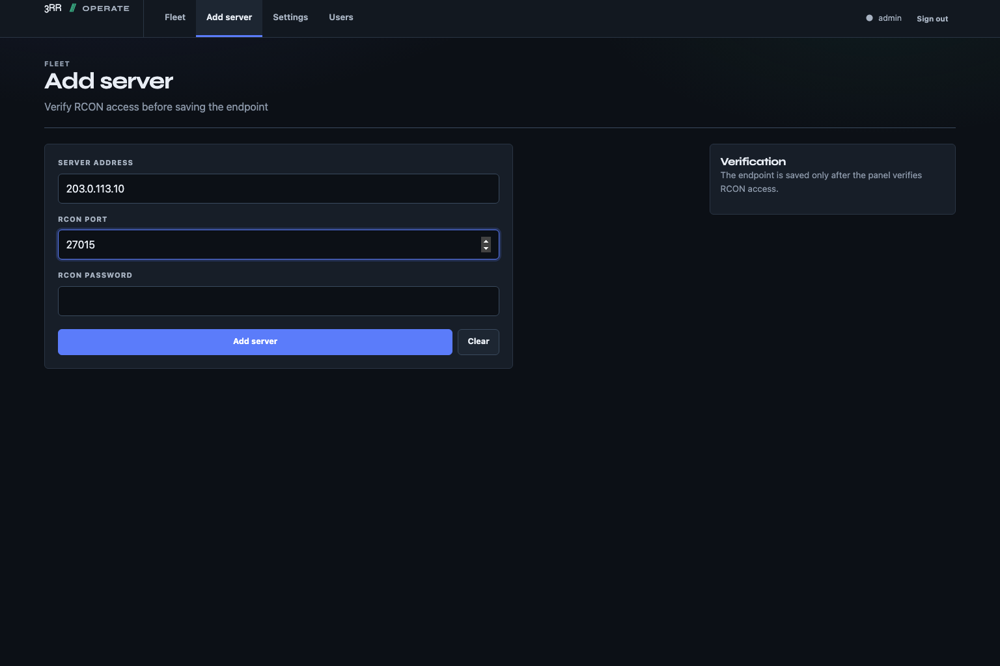
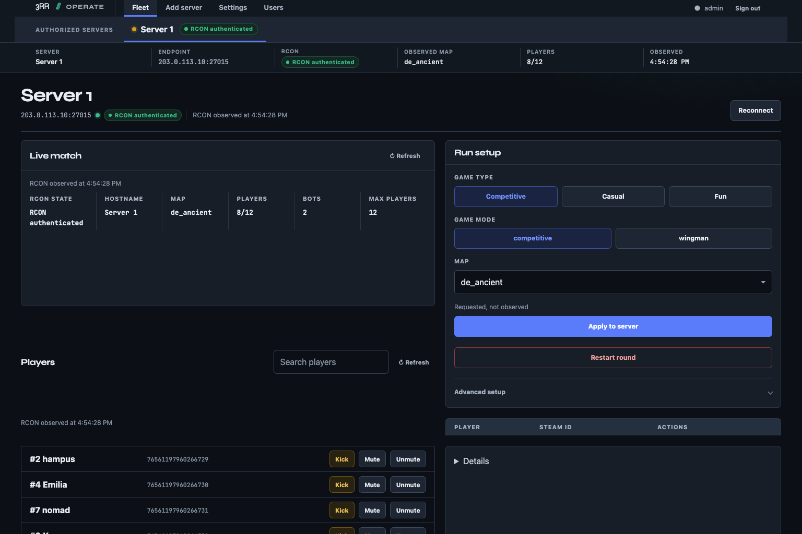

# 3RR Operate Panel

The operate panel is an Express and EJS application for authenticated control
of existing Counter-Strike 2 servers over RCON.

## Capabilities

- user authentication, administrator accounts, and per-server access grants
- server inventory and connection status
- live status and player observations
- fixed game, match, bot, map, Workshop, MatchZy, and backup controls
- a single-command RCON console with blocked-command and input checks
- Workshop favorites and sent-command history
- SQLite storage
- Redis-backed production sessions and rate limits

The panel does not install or update CS2, CFG files, maps, or plugins. It does
not run commands on the server host. Plugin-backed controls require the
server-side files listed in [docs/SERVER-SETUP.md](docs/SERVER-SETUP.md).

## Request and data flow

1. Express authenticates the operator through a session cookie.
2. SQLite stores users, servers, access grants, favorites, and RCON history.
3. Server-scoped routes check the current user's access before each operation.
4. The RCON manager maintains one connection state per server and serializes
   commands sent to the same server.
5. The manager reads RCON passwords from SQLite when connecting. Its in-memory
   server records contain only host and port.

## Requirements

- Node.js 22
- npm
- Redis when `NODE_ENV=production`
- Docker with Compose for the included container deployment

## Installation

```bash
cd apps/operate/panel
npm ci
cp .env.example .env
```

Set local values in `.env`. `SESSION_SECRET` must contain at least 32 characters
in production. `RCON_SECRET_KEY` must be a 32-byte base64 or hex key in
production.

For the first start with an empty database, set
`ALLOW_DEFAULT_CREDENTIALS=true`, `DEFAULT_USERNAME`, and a password of at
least 12 characters. Remove those credential values and set
`ALLOW_DEFAULT_CREDENTIALS=false` after the administrator exists.

## Usage

Build and start the panel:

```bash
npm run build
node --env-file=.env dist/app.js
```

Open `http://localhost:3000`.

`npm start` runs `dist/app.js` with variables already exported in the process
environment. It does not read `.env`. For a watch-mode development server,
export the required variables in the shell and run:

```bash
npm run dev
```

## Configuration

| Variable                  | Required        | Default                       | Purpose                                                                    |
| ------------------------- | --------------- | ----------------------------- | -------------------------------------------------------------------------- |
| `SESSION_SECRET`          | Production      | Temporary development value   | Signs session cookies; production requires 32 or more characters           |
| `RCON_SECRET_KEY`         | Production      | Unset                         | Encrypts stored RCON passwords; accepts a 32-byte base64 or hex key        |
| `REDIS_URL`               | Production      | Unset                         | Redis connection for sessions and rate limits                              |
| `PORT`                    | No              | `3000`                        | HTTP listen port                                                           |
| `DB_PATH`                 | No              | `/home/container/data/3rr.db` | SQLite file; local development can fall back to `./data/3rr.db` when unset |
| `TRUST_PROXY`             | Proxy dependent | `false`                       | Express trusted-proxy hop count or boolean                                 |
| `SESSION_COOKIE_SECURE`   | No              | `true` in production          | Requires HTTPS when enabled                                                |
| `SESSION_COOKIE_SAMESITE` | No              | `strict`                      | Session cookie SameSite mode                                               |
| `SESSION_COOKIE_NAME`     | No              | `3rr.sid`                     | Session cookie name                                                        |
| `SESSION_MAX_AGE_MS`      | No              | `86400000`                    | Rolling session lifetime in milliseconds                                   |
| `RCON_COMMAND_TIMEOUT_MS` | No              | `2000`                        | Per-command timeout in milliseconds                                        |
| `HEALTHCHECK_VERBOSE`     | No              | `false`                       | Exposes detailed unauthenticated health state when true                    |

`PANEL_BIND_ADDRESS` belongs to `docker-compose.yaml`, not the Node process. It
defaults to `127.0.0.1`.

See the complete shared contract in
[docs/reference/env.md](../../../docs/reference/env.md).

## Scripts

| Command                                | Purpose                                                  |
| -------------------------------------- | -------------------------------------------------------- |
| `npm run dev`                          | Build browser code, then run the server in watch mode    |
| `npm run build`                        | Compile the server and browser code                      |
| `npm start`                            | Run `dist/app.js` with the current process environment   |
| `npm run format:check`                 | Check formatting                                         |
| `npm run lint`                         | Run ESLint                                               |
| `npm run typecheck`                    | Check server and browser TypeScript                      |
| `npm test`                             | Compile and run the Node test suite                      |
| `npm run test:e2e`                     | Build and run Chromium Playwright tests                  |
| `npm run validate`                     | Check shell, JSON, and YAML; run available Docker checks |
| `npm run validate -- --require-docker` | Require all Docker validation                            |
| `npm run screenshots`                  | Capture the documented panel views                       |

## Testing

```bash
npm run format:check
npm run lint
npm run typecheck
npm test
npm run test:e2e
npm run build
npm run validate -- --require-docker
```

Install the Playwright Chromium binary once with
`npm run test:e2e:install`. The browser suite starts the built application on
`127.0.0.1:3210` with an isolated SQLite database under `.e2e/`.

## Deployment

The included Compose file builds the panel, starts Redis, mounts `./data` at
`/home/container/data`, and publishes the panel on loopback:

```bash
cp .env.example .env
docker compose up --build
```

Set real secrets in `.env` before starting. The container does not terminate
TLS. Keep `PANEL_BIND_ADDRESS=127.0.0.1` unless a TLS-terminating reverse proxy
and network access controls are in place. Set `TRUST_PROXY` only to the proxy
hops you operate.

Read [docs/RUNBOOK.md](docs/RUNBOOK.md) for storage, migration, health, and
shutdown details. The HTTP contract is in [docs/API.md](docs/API.md).
Frontend source and browser behavior are described in
[docs/FRONTEND.md](docs/FRONTEND.md). The maintained file map is in
[docs/REPO_MAP.md](docs/REPO_MAP.md).

## Panel tour

The screenshots use an isolated SQLite database, the reserved documentation
address `203.0.113.10`, and empty public credential fields. They do not connect
to a live RCON server. The inventory shows the initial unknown state, while the
management captures use fixed local HTTP responses for status, players, and
history.

### Login



### Server inventory



### Add a server



### Manage a server



The [screenshot manifest](docs/screenshots/README.md) lists all eight files,
their dimensions, and the capture command.

## Security

- Keep the panel behind HTTPS.
- Use Redis in production.
- Protect `.env`, the SQLite database, backups, and logs as secrets.
- Restrict network access to RCON endpoints.
- Do not weaken the single-command ASCII validation for console input.
- Back up the SQLite database before upgrading.

Report vulnerabilities using
[SECURITY.md](SECURITY.md). Contribution requirements are in
[CONTRIBUTING.md](CONTRIBUTING.md).
