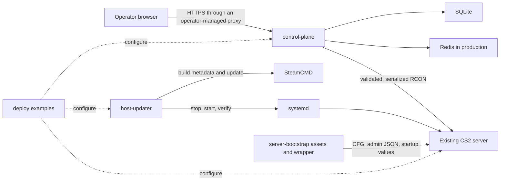
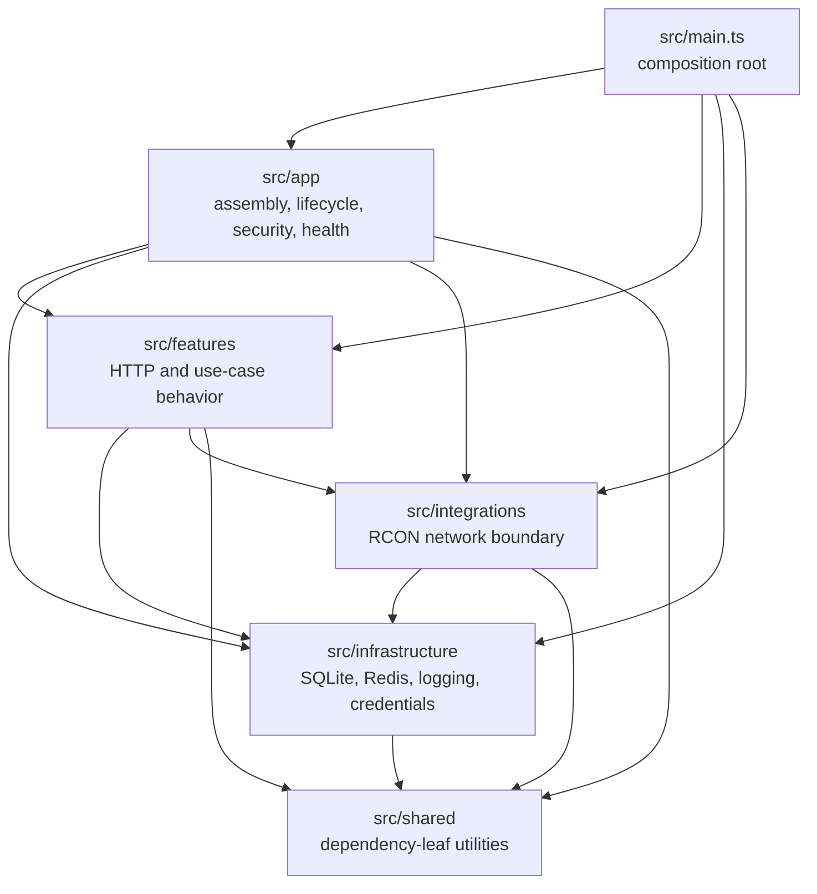
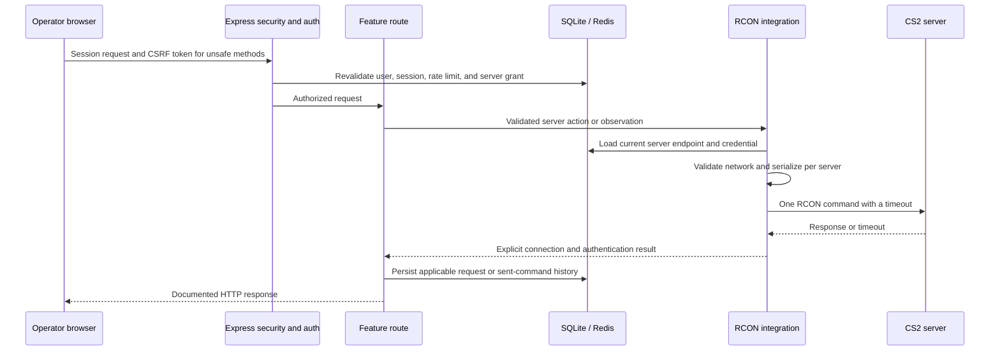

# Architecture

3RR has separate modules for live server control, host maintenance, and server
configuration. You can deploy each operational module on its own. They share
configuration conventions and documentation, but they do not call one another
at runtime.

## System context

The control plane talks to CS2 only through RCON; it does not invoke a host
shell or SteamCMD. The updater is a local command-line tool rather than a web
or RCON service. Server-bootstrap provides files and startup values for a CS2
runtime and does not run as a daemon.

## Components

| Component           | Responsibility                                                                                                                        | Runtime and state boundary                                                                      |
| ------------------- | ------------------------------------------------------------------------------------------------------------------------------------- | ----------------------------------------------------------------------------------------------- |
| `control-plane/`    | Authenticate operators, authorize server access, render the web interface, expose HTTP routes, and control existing servers over RCON | Node 22 process with SQLite, Redis in production, and outbound RCON connections                 |
| `host-updater/`     | Compare local and remote Steam build IDs, then stop, update, verify, and restart the server                                           | Bash process running as root on a Linux host with systemd and SteamCMD; stores its lock and log |
| `server-bootstrap/` | Supply reviewed CFG files, generate private administrator files, and build the CS2 startup command                                    | Scripts and static files consumed by the target CS2 runtime                                     |
| `deploy/`           | Provide Compose and systemd examples                                                                                                  | Examples only; the operator chooses images, storage, networks, proxies, and secrets             |
| `design-preview/`   | Show the current operator interface with fixed mock data                                                                              | Static pages built from panel templates and styles; local interactions without production connections |

The control plane, updater, and bootstrap module can each be built, tested, and
deployed independently. The static demo is separate from the deployed system.

## Control-plane structure

`control-plane/src/main.ts` is the only entry point that assembles the process.
It opens SQLite, creates the Redis and RCON services, builds the Express
application, and manages startup and shutdown.

The source dependencies follow these rules:

- `features`, `infrastructure`, and `integrations` do not import `app`.
- `infrastructure` does not import `features` or `integrations`.
- `integrations` may use infrastructure adapters but does not import
  `features`.
- `shared` imports no application layer.
- Feature-to-feature dependencies remain acyclic.

`npm run check:architecture` checks these import rules in source code.

Credential encoding belongs in
`src/infrastructure/credentials/rconCredential.ts`, server authorization in
`src/features/server-access`, catalog data in
`src/features/game-catalog`, and RCON command parsing and policy in
`src/integrations/rcon/rconCommandPolicy.ts`.

### HTTP and RCON flow

Before a request reaches a feature route, middleware applies security headers,
body limits, sessions, CSRF protection, and rate limits. Protected requests
reload the user from SQLite. Administrator rights and per-server access grants
are checked separately. Unless the API documents an exception, an
authenticated request that changes state requires a CSRF token.

Before connecting, RCON validation resolves the endpoint and pins an acceptable
address. The manager sends one command at a time to each server and tracks
connection and authentication separately. Every operation has a timeout. The
free-form console accepts one printable ASCII command, rejects separators, and
blocks verbs that could change process, credential, logging, plugin, or RCON
configuration.

The manager schedules regular commands in FIFO order. It allows one active
command and 32 waiting commands per server, with 256 waiting across all servers
by default. Each server also has one reserved heartbeat slot, and overlapping
heartbeats are combined. A twelve-second deadline covers initialization, queue
time, reconnects, and command execution.

Cancelling an HTTP request also cancels work that is still queued. Once a
command has been dispatched, cancellation reports an uncertain outcome; the
manager never retries a state-changing command automatically. At startup,
stored servers are registered before four connection workers begin. The
initialization summary follows the database order.

Successful observations of `hostname`, `status`, `sv_visiblemaxplayers`, and
`users` are cached for five seconds. Authorized inventory, management, status,
and player routes reuse both work in progress and its observation time. One
caller can cancel without affecting the others; the underlying work is
cancelled when every caller has left. Generation numbers stop invalidated
results from returning to the cache. Changes to server state or connections,
server removal, and shutdown all invalidate observations.

The navigation rail loads the server list without starting observations. On
the fleet page, at most four status HTTP requests run at once.

### Browser sources

- `web/views/` contains EJS pages and partials.
- `web/client/` contains browser TypeScript.
- `web/assets/` contains stylesheet and image sources.
- `web/generated/` is generated build output and must not be edited.

Browser code and tests depend on template IDs and `data-*` attributes, so they
are part of the interface between templates and scripts. See the [frontend
guide](../control-plane/docs/FRONTEND.md) for details.

## State ownership

SQLite stores durable control-plane data: users, administrator flags, server
inventory, access grants, preferences, Workshop favorites, requested setups,
and sent-command history. Migrations run in transactions and move forward
through `PRAGMA user_version`; schema version 3 is current. The application
refuses to start with a newer or malformed schema.

In production, Redis stores sessions and shared rate-limit state. Server
inventory and users remain in SQLite.

When `RCON_SECRET_KEY` is configured, stored RCON passwords use the `enc:v1`
format. The key is required in production. Changing or removing it without
migrating the credentials can make them unreadable.

The updater writes only its host-local configuration, lock directory, log, and
the CS2 installation and service during an update. Bootstrap output and CS2
runtime state are files on the operator's server and are not control-plane
data.

## Deployment and lifecycle

The control-plane Compose example starts the application and Redis, stores their
data in volumes, and publishes the application on the loopback interface by
default. It does not terminate TLS. The CS2 runtime Compose example uses an
external image and needs to be adapted to the target host. The updater runs
directly on a Linux host with systemd and SteamCMD, outside the control-plane
container.

At startup, the control plane applies compatible database migrations before it
serves requests. It connects to Redis before creating session and rate-limit
middleware, then initializes the RCON services. `SIGTERM` and `SIGINT` begin a
graceful shutdown of HTTP, RCON, Redis, and SQLite, with a 15-second deadline.

`GET /api/health` reports whether the control-plane process is alive and ready.
It does not report the health of the updater or CS2 server, or of the deployment
as a whole. The Compose example does not define a control-plane healthcheck;
deployment checks call the endpoint separately.

## Adding or changing behavior

Add operator behavior to a feature without creating a feature dependency cycle.
External protocols belong under `src/integrations`, while local persistence and
service adapters belong under `src/infrastructure`. Add browser behavior in the
source directories and preserve the DOM attributes used by existing scripts and
tests.

Keep these compatibility and safety requirements in place:

- documented HTTP routes and response shapes;
- session, proxy, CSRF, authorization, and rate-limit behavior;
- SQLite migration compatibility and the `enc:v1` credential format;
- per-server RCON serialization, network validation, state, and timeouts;
- updater CLI, configuration, systemd names, and the
  `/opt/3rr/apps/maintain/updater` installation path;
- the relationship between the bootstrap capability manifest and the shipped
  files.

## What 3RR does not provide

3RR does not provision operating systems, install CS2 or plugins, provide a
Pterodactyl egg, host a managed service, or terminate TLS. A control backed by a
CFG file only works when the target server has the required file and any
supporting plugin or map. Local repository checks cannot confirm behavior in a
live CS2, RCON, SteamCMD, systemd, Redis, backup, network, or accessibility
environment.

## Related documentation

- [Control-plane README](../control-plane/README.md)
- [HTTP API](../control-plane/docs/API.md)
- [Operations runbook](../control-plane/docs/RUNBOOK.md)
- [Environment variables and updater settings](reference/env.md)
- [Host updater](../host-updater/README.md)
- [Server bootstrap](../server-bootstrap/README.md)
- [Provisioning](workflows/provision-server.md) and
  [disaster recovery](workflows/disaster-recovery.md)
