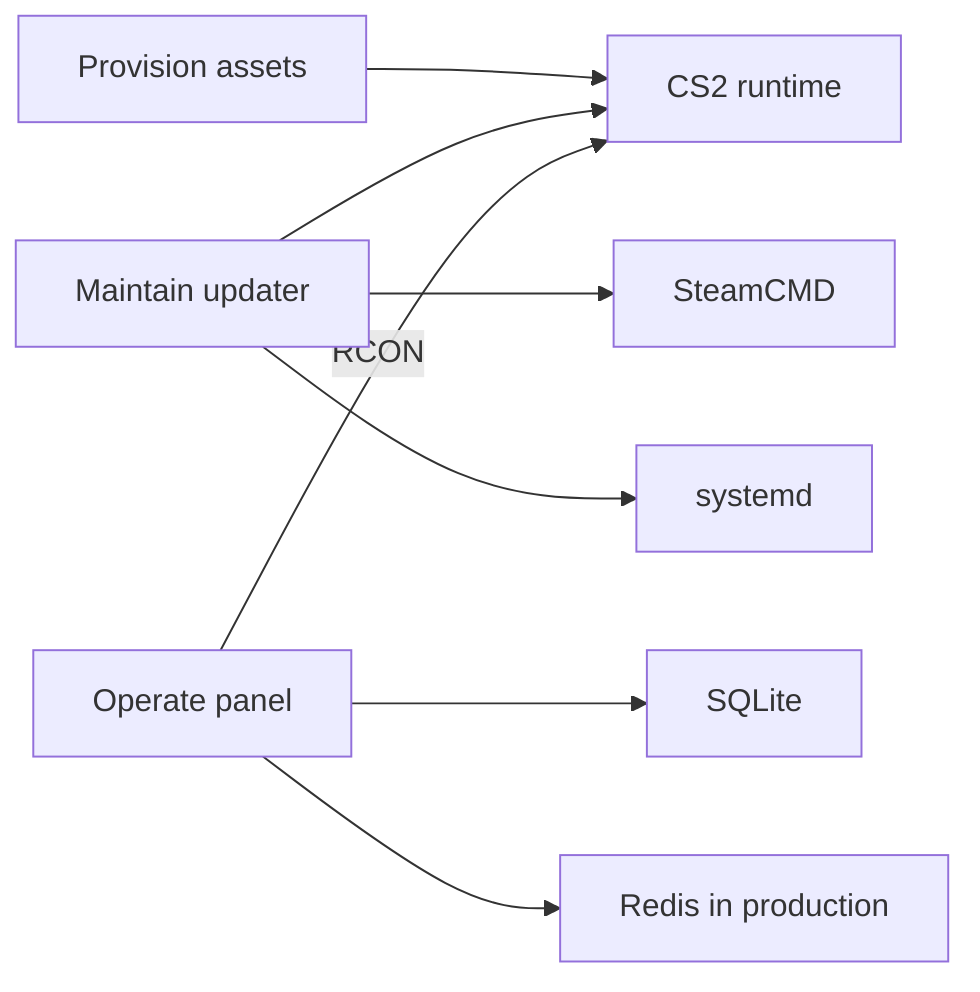

# Architecture

3RR separates server setup, host maintenance, and live operation into three
runtime-independent modules.

## Provision

`apps/provision/bootstrap` writes static admin and plugin files and provides a
validated startup wrapper. `configs/examples` contains deployment examples. The
module does not install the server or keep a background process running.

## Maintain

`apps/maintain/updater` is a Bash program intended for a Linux host. It reads
the installed build ID, queries SteamCMD for the remote build ID, and operates
the configured systemd unit only when an update is confirmed. It does not
depend on the panel.

## Operate

`apps/operate/panel` is a Node.js application. SQLite stores users, server
inventory, access grants, favorites, and RCON history. Redis stores production
sessions and rate-limit state. The RCON manager serializes commands for each
server and maintains explicit connection and authentication state.

The panel does not call SteamCMD, invoke host shells, or install server files.

## Shared contracts

The modules share environment names, example paths, documentation, and
repository verification. Module-specific runtime code stays under its module
directory. See [reference/env.md](reference/env.md) and
[reference/topology.md](reference/topology.md).

Module origin and licensing information is in
[reference/provenance.md](reference/provenance.md).
