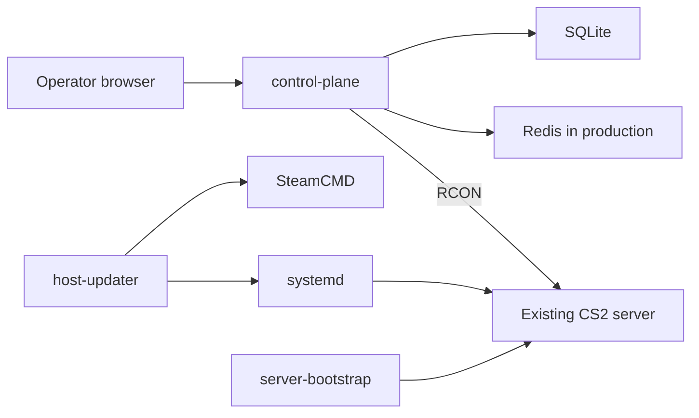

# Architecture

3RR separates server configuration, host maintenance, and live operation. The
three modules share contracts but have no runtime dependency on one another.



## Control plane

`control-plane` is a Node 22 Express/TypeScript application. It uses SQLite
for users, server inventory, access grants, Workshop favorites, and RCON
history. Redis backs production sessions and rate limits. It renders EJS pages
and serves browser bundles generated from maintained web sources.

`src/main.ts` is the sole process composition root. The control-plane
dependency direction is:

```text
app -> features / infrastructure / integrations / shared
features -> infrastructure / integrations / shared
integrations -> infrastructure / shared
infrastructure -> shared
shared -> no application layer
```

`src/app` owns application assembly and lifecycle. `src/features` owns HTTP
routes and use-case behavior. `src/infrastructure` owns SQLite, Redis, and
logging. `src/integrations` owns RCON and its network boundary. `src/shared`
contains dependency-leaf utilities. `web/client`, `web/assets`, and
`web/views` are maintained browser sources; `web/generated` is build output.

Within those boundaries, credential encoding belongs to
`src/infrastructure/credentials/rconCredential.ts`, server access belongs to
`src/features/server-access`, game catalog data belongs to
`src/features/game-catalog`, and RCON command parsing and policy belongs to
`src/integrations/rcon/rconCommandPolicy.ts`.

The control plane never provisions a host, invokes SteamCMD, or executes shell
commands on a CS2 host.

## Host updater

`host-updater` is an independent Bash transaction for a Linux host. It compares
local and remote Steam build IDs, leaves the service running when the remote
state is unknown, and only stops, updates, and restarts a service after a
confirmed change. It owns its lock, timeout, retry, and recovery behavior.

The source directory changed, but the installed interface remains
`/opt/3rr/apps/maintain/updater`: updater CLI behavior, configuration path,
and `3rr-update` systemd unit are compatibility contracts.

## Server bootstrap

`server-bootstrap` provides shipped CFG assets, an explicit capabilities
manifest, atomic owner-only administrator bootstrap output, and the CS2 startup
wrapper. It validates runtime inputs, links only manifest-listed CFG paths, and
removes `RCON_PASSWORD` and `CS2_GSLT` from the launched server environment.
It does not install software or run as a service.

## Shared contracts

The public control-plane HTTP and API contract is in
[control-plane/docs/API.md](../control-plane/docs/API.md). State-changing
authenticated requests use CSRF unless the API explicitly documents an
exception. SQLite migrations are forward-only through `PRAGMA user_version`;
the currently supported schema is version 3. Encrypted stored RCON credentials
are prefixed `enc:v1` and require a compatible `RCON_SECRET_KEY`.

Deployment examples are under `deploy/`. Shared environment names and topology
are documented in [reference/env.md](reference/env.md) and
[reference/topology.md](reference/topology.md).
