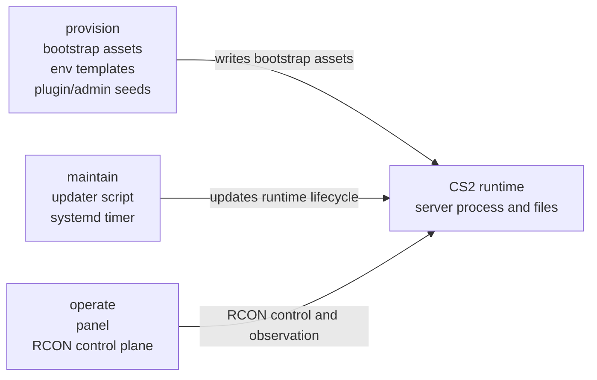

# Architecture

`3rr` is one product with three module boundaries:

- `provision`: bootstrap a server runtime and supporting assets
- `maintain`: keep an existing server updated safely
- `operate`: control and monitor running servers

## Module Relationships

## Runtime Flow

1. `provision` creates files an operator can copy into the CS2 runtime.
2. `maintain` reads its own config, compares local and remote Steam build IDs, and updates the
   CS2 runtime only when a real update is known to be required.
3. `operate` keeps users, server inventory, access grants, and last-known game state in SQLite.
   It connects to CS2 servers over RCON and does not run SteamCMD or shell into hosts.

The root docs and env examples are the shared contract between modules. Runtime code stays inside
its module boundary.

## Why The Split Exists

Operators think in lifecycle stages, but the implementation still needs clear seams:

- bootstrap assets should not drag in a web app
- the updater should remain usable on a plain host
- the panel should not become a host orchestration daemon

## Provenance

The retained module-origin and licensing boundary is documented in
[reference/provenance.md](reference/provenance.md). Internal audit, migration-ledger, and
remediation packets are not part of the public product documentation.

## Explicit Exclusions

- archived audit workspaces
- local temp data, DB state, screenshots from ad-hoc verification, and generated bundles
- Pterodactyl-first runtime packaging as the default deployment path

## Publication Intent

This repo publishes from `main`. A release tag must identify the exact verified commit; a
dirty or divergent remediation branch is not a releasable candidate.
