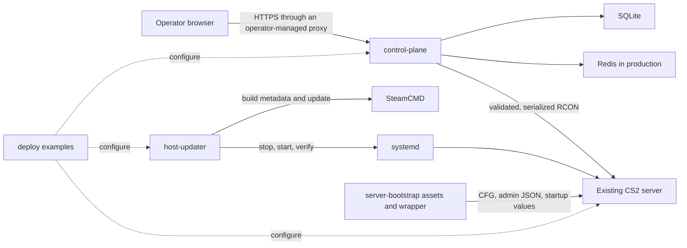
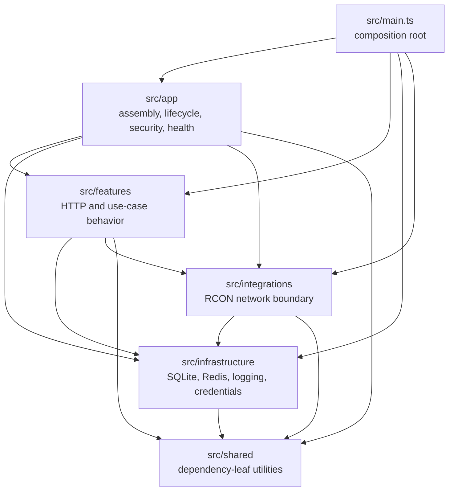
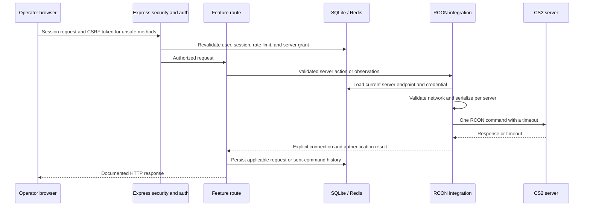

# Architecture

## In short

- 3RR is made of **separate modules**: the panel (control plane) for live server control, the
  updater for host maintenance, and the bootstrap files for server configuration. You can
  deploy each one on its own. They share configuration conventions and documentation but
  **never call one another while running**.
- The panel reaches CS2 **only through RCON**. It never runs host shell commands or SteamCMD.

- The panel sends each server **one command at a time**, and every operation has a timeout.
  It **never automatically retries** a state-changing command that it has already sent.

- These are **design rules**. Automated checks enforce some of them in the code, but local
  checks cannot confirm behaviour against a live CS2, RCON, SteamCMD, systemd, Redis, backup,
  network, or accessibility environment.

## How the parts connect

```mermaid
flowchart LR
    Operator["Operator browser"] -->|HTTPS through an operator-managed proxy| Panel["control-plane"]
    Panel --> SQLite["SQLite"]
    Panel --> Redis["Redis in production"]
    Panel -->|validated, serialized RCON| CS2["Existing CS2 server"]

    Updater["host-updater"] -->|build metadata and update| SteamCMD["SteamCMD"]
    Updater -->|stop, start, verify| Systemd["systemd"]
    Systemd --> CS2

    Bootstrap["server-bootstrap assets and wrapper"] -->|CFG, admin JSON, startup values| CS2

    Deploy["deploy examples"] -. configure .-> Panel
    Deploy -. configure .-> Updater
    Deploy -. configure .-> CS2
```

How to read the diagram:

- Your browser reaches the panel over HTTPS through a reverse proxy **that you run**.
- The panel keeps its data in SQLite, plus Redis in production.
- The panel talks to each CS2 server over RCON. Commands are checked first ("validated") and
  sent one at a time per server ("serialized").
- The **updater** is a local command-line tool, not a web or RCON service. It asks SteamCMD
  whether a newer build exists, and uses systemd to stop, update, start, and verify the server.
- The **bootstrap** module is not a running service. It supplies CFG files, administrator
  files, and startup values that the CS2 server reads.
- The **deploy examples** are templates you adapt; they run nothing by themselves.

## The components

| Component                    | Responsibility                                                                                                                    | Where it runs and what it stores                                                                              |
| ---------------------------- | --------------------------------------------------------------------------------------------------------------------------------- | ------------------------------------------------------------------------------------------------------------- |
| `control-plane/` (the panel) | Sign operators in, check which servers each one may control, render the web interface, expose HTTP routes, control existing servers over RCON | A Node 26 process with SQLite, Redis in production, and outbound RCON connections                             |
| `host-updater/`              | Compare the local and remote Steam build IDs; if they differ, stop, update, verify, and restart the server                        | A Bash process running as root on a Linux host with systemd and SteamCMD; keeps its own lock and log          |
| `server-bootstrap/`          | Supply reviewed CFG files, generate private administrator files, and build the CS2 startup command                                | Scripts and static files that the CS2 runtime reads                                                           |
| `deploy/`                    | Provide Compose and systemd examples                                                                                              | Examples only; you choose images, storage, networks, proxies, and secrets                                     |
| `design-preview/`            | Show the current interface with fixed sample data                                                                                 | Static pages built from the panel's templates and styles; local interactions without production connections |

The panel, updater, and bootstrap module can each be built, validated, and deployed
independently. The static demo is separate from the deployed system.

## Inside the panel: code layers

*This section is mainly for contributors.*

`control-plane/src/main.ts` is the only file that assembles the running process. It opens
SQLite, creates the Redis and RCON services, builds the Express web application, and manages
startup and shutdown.

```mermaid
flowchart TB
    Main["src/main.ts\ncomposition root"] --> App["src/app\nassembly, lifecycle, security, health"]
    Main --> Features["src/features\nHTTP and use-case behavior"]
    Main --> Infrastructure["src/infrastructure\nSQLite, Redis, logging, credentials"]
    Main --> Integrations["src/integrations\nRCON network boundary"]

    App --> Features
    App --> Infrastructure
    App --> Integrations
    App --> Shared["src/shared\ndependency-leaf utilities"]
    Features --> Infrastructure
    Features --> Integrations
    Features --> Shared
    Integrations --> Infrastructure
    Integrations --> Shared
    Infrastructure --> Shared
```

What each layer holds:

- `app`: assembly, lifecycle, security, and health.
- `features`: what each HTTP route does.
- `infrastructure`: SQLite, Redis, logging, and credentials.
- `integrations`: the RCON network boundary.
- `shared`: small utilities that depend on nothing else.

Dependencies point *away* from the assembly code. The rules below keep each layer replaceable:

- `features`, `infrastructure`, and `integrations` never import `app`.
- `infrastructure` never imports `features` or `integrations`.
- `integrations` may use infrastructure adapters but never imports `features`.
- `shared` imports no other layer.
- Features may depend on one another, but never in a cycle.
- Code outside `src/integrations/rcon/` reaches RCON **only** through
  `src/integrations/rcon/index.ts`.
- Stored RCON data (server credentials, the server list, and command history) lives in
  `src/infrastructure/sqlite`, not in `src/integrations`.
- SQL statements and transactions appear only in a feature's `repository.ts` (or
  `*Repository.ts`) or in `src/infrastructure/sqlite`. Route, router, and app files call
  repository methods instead of calling `better-sqlite3` directly.

Where specific responsibilities live:

| Responsibility                                     | Location                                          |
| -------------------------------------------------- | ------------------------------------------------- |
| Encoding stored RCON credentials                   | `src/infrastructure/credentials/rconCredential.ts` |
| Checking server access                             | `src/features/server-access`                      |
| Game and map catalog data                          | `src/features/game-catalog`                       |
| Parsing RCON commands and deciding which are allowed | `src/integrations/rcon/rconCommandPolicy.ts`    |

## What happens when you press a button

```mermaid
sequenceDiagram
    participant B as Operator browser
    participant E as Express security and auth
    participant F as Feature route
    participant D as SQLite / Redis
    participant R as RCON integration
    participant C as CS2 server

    B->>E: Session request and CSRF token for unsafe methods
    E->>D: Revalidate user, session, rate limit, and server grant
    E->>F: Authorized request
    F->>R: Validated server action or observation
    R->>D: Load current server endpoint and credential
    R->>R: Validate network and serialize per server
    R->>C: One RCON command with a timeout
    C-->>R: Response or timeout
    R-->>F: Explicit connection and authentication result
    F->>D: Persist applicable request or sent-command history
    F-->>B: Documented HTTP response
```

**Before any server is touched**:

- Every request passes security headers, request-size limits, the login session, CSRF
  protection, and rate limits.
- Protected requests reload your user account from the database, so a removed or changed
  account takes effect immediately.
- Administrator rights and per-server access grants are checked separately.
- Unless the [API documentation](../control-plane/docs/API.md) documents an exception, a
  signed-in request that changes something must carry a CSRF token.

**RCON guarantees**:

- Before connecting, the panel resolves the server's address, checks it, and uses only that
  checked address ("pins" it).
- It sends one command at a time to each server.
- It tracks "connected" and "authenticated" separately, so you can tell a network problem from
  a wrong password.
- Every operation has a timeout.
- The free-form console accepts a single command in printable ASCII (plain keyboard
  characters). It rejects command separators. It also blocks commands that could change the
  server process, credentials, logging, plugins, or RCON configuration.

## Queueing, timeouts, and cached observations

An **observation** is a status reading the panel took from a server, together with the time
it was taken.

**Queue.** Regular commands are handled first come, first served. Per server, 1 command runs
while up to 32 wait. Across all servers, up to 256 can wait by default. Each server also has
one slot reserved for its heartbeat (the regular connection check), and overlapping heartbeats
are merged into one.

**Deadline.** A single 12-second deadline covers the whole operation: setup, waiting in the
queue, reconnecting, and running the command.

**Cancelling.** If you cancel a web request while its command is still waiting, the command
is dropped. If the command was already sent, the outcome is reported as **uncertain**. The
panel never retries a state-changing command on its own.

**Startup.** Stored servers are registered first, then four connection workers begin. The
startup summary lists servers in database order.

**Reusing observations.**

- Successful observations of `hostname`, `status`, `sv_visiblemaxplayers`, and `users` are
  reused for five seconds.
- When several authorized views ask for the same observation at once (inventory, management,
  status, and player views), they share both the work in progress and its observation time.
- One caller can cancel without affecting the others. The shared work stops only when every
  caller has left.
- Generation numbers keep an invalidated result from returning to the cache.
- Changes to server state or connections, server removal, and shutdown all discard cached
  observations.

**Fleet page load.** The navigation rail loads the server list without starting any
observations. On the fleet page, at most four status HTTP requests run at once.

## Browser code

*For contributors*:

- `web/views/`: EJS page templates and partials.
- `web/client/`: browser TypeScript.
- `web/assets/`: stylesheet and image sources.
- `web/generated/`: generated build output. **Never edit it by hand.**

Browser scripts find page elements by template IDs and `data-*` attributes. That
makes these attributes part of the contract between templates and scripts: renaming one breaks
behaviour. See the [frontend guide](../control-plane/docs/FRONTEND.md).

## Where data lives

**SQLite** holds everything the panel must keep: users, administrator flags, the server list,
access grants, preferences, Workshop favourites, requested setups, and sent-command history.
Database migrations run inside transactions and only move forward, tracked by SQLite's
`PRAGMA user_version`. Version 3 is current. The panel refuses to start on a database with a
newer or malformed structure.

**Redis** holds login sessions and shared rate-limit counters in production. The server list
and users stay in SQLite.

**Stored RCON passwords.** When the RCON encryption key (`RCON_SECRET_KEY`) is set, stored RCON
passwords use the `enc:v1` format. The key is required in production. **If you change or remove
the key without migrating the stored credentials, they can become unreadable.**

**Updater and bootstrap data.** The updater writes only its host configuration, lock directory,
and log, plus the CS2 installation and service during an update. Bootstrap output and CS2's
own runtime files are files on your server, not panel data.

## Deployment, startup, and shutdown

- The panel's Compose example starts the panel and Redis, keeps their data in volumes, and by
  default makes the panel reachable only from the host itself. It does **not** handle HTTPS.
- The CS2 runtime Compose example uses an external image; you need to adapt it to your host.
- The updater runs directly on a Linux host with systemd and SteamCMD, outside the panel's
  container.

**Startup order:**

1. Apply compatible database migrations. No request is served before this finishes.
2. Connect to Redis.
3. Set up sessions and rate limits.
4. Start the RCON services.

**Shutdown.** `SIGTERM` or `SIGINT` starts a graceful shutdown of HTTP, RCON, Redis, and
SQLite, with a 15-second deadline.

**Health endpoint.** `GET /api/health` reports only whether the **panel process** is alive and
ready. It says nothing about the updater, the CS2 servers, or the deployment as a whole. The
Compose example defines no health check for the panel; deployment checks call the endpoint
separately. Details are in the [runbook](../control-plane/docs/RUNBOOK.md#health-checks-and-shutdown).

## Changing 3RR safely

*For contributors*:

- Add operator behaviour to a feature without creating a cycle between features.
- New external protocols go under `src/integrations`. Local storage and service adapters go
  under `src/infrastructure`.
- Add browser behaviour in the source folders, and keep the DOM attributes that existing
  scripts depend on.

These compatibility and safety guarantees must stay in place:

- documented HTTP routes and response shapes;
- session, proxy, CSRF, authorization, and rate-limit behaviour;
- SQLite migration compatibility and the `enc:v1` credential format;
- per-server RCON serialization, network validation, connection state, and timeouts;
- the updater's command-line interface, configuration, systemd unit names, and the
  `/opt/3rr/apps/maintain/updater` install path;
- the match between the bootstrap capability manifest and the shipped files.

## What 3RR does not provide

- 3RR does not provision operating systems, install CS2 or plugins, provide a Pterodactyl
  egg, run as a hosted service, or handle HTTPS.
- A control backed by a CFG file works only if the target server has that file and any plugin
  or map it needs. See the [CS2 server requirements](../control-plane/docs/SERVER-SETUP.md).
- Local repository checks cannot confirm behaviour in a live CS2, RCON, SteamCMD, systemd,
  Redis, backup, network, or accessibility environment.

## Related documentation

- [Panel README](../control-plane/README.md)
- [HTTP API](../control-plane/docs/API.md)
- [Operations runbook](../control-plane/docs/RUNBOOK.md)
- [Environment variables and updater settings](reference/env.md)
- [Host updater](../host-updater/README.md)
- [Server bootstrap](../server-bootstrap/README.md)
- [Provisioning](workflows/provision-server.md) and
  [disaster recovery](workflows/disaster-recovery.md)
- [Backup and recovery rehearsal](recovery.md) (step-by-step procedure)

## Glossary

- **Access grant**: permission for one user to control one server.
- **Composition root**: the single place where the application's parts are created and wired
  together (`src/main.ts`).
- **CSRF protection**: a safeguard that stops another website from triggering actions in your
  signed-in panel.
- **Database migration**: an automatic, forward-only upgrade of the database structure at
  startup.
- **`enc:v1`**: the format used for encrypted stored RCON passwords.
- **Express / EJS**: the web framework and the HTML template system that the panel uses.
- **FIFO**: first in, first out; the order in which queued commands run.
- **Generation number**: a counter that marks a cached result as outdated.
- **Heartbeat**: the panel's regular connection check to each server.
- **Mermaid**: a text format for diagrams that GitHub renders as pictures.
- **Observation**: a status reading the panel took from a server, with its time.
- **Rate limit**: a cap on how many requests are accepted in a period.
- **RCON**: the password-protected remote-console protocol for game servers.
- **RCON encryption key (`RCON_SECRET_KEY`)**: the key that encrypts stored RCON passwords.
- **Redis**: a data store for sessions and rate limits in production.
- **SIGTERM / SIGINT**: standard signals that ask a process to stop.
- **SQLite**: a single-file database.
- **SteamCMD**: Valve's command-line tool for installing and updating game servers.
- **systemd**: the Linux service manager.
