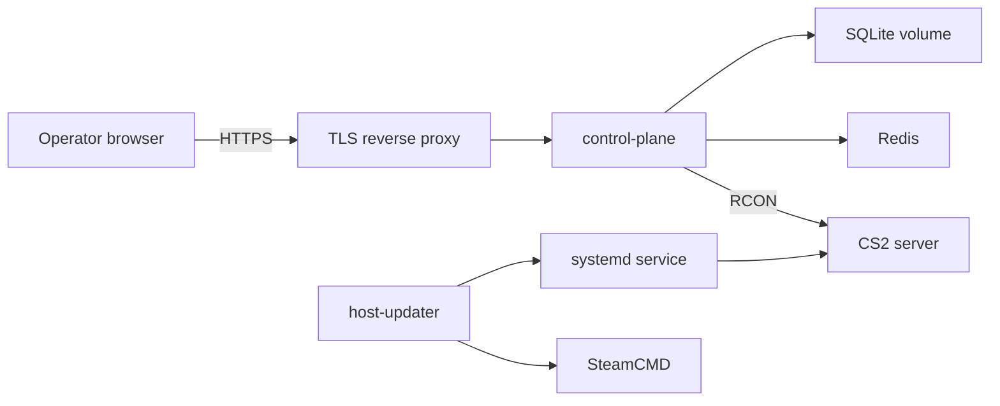

# Deployment topology

A complete installation can run the updater and CS2 on one Linux host while the
panel runs on the same host or another private host.

The control-plane Compose example at `deploy/compose/control-plane.compose.yaml`
publishes `127.0.0.1:3000` and does not terminate TLS. Keep that loopback bind
behind a TLS reverse proxy. If the control plane and CS2 run on different
hosts, restrict RCON traffic to the control-plane host.

The host updater requires direct access to systemd, SteamCMD, the CS2
installation, and its root-owned log path. Do not place it inside the
control-plane container.

Server-bootstrap files are inputs to the CS2 runtime. They are not a service.
